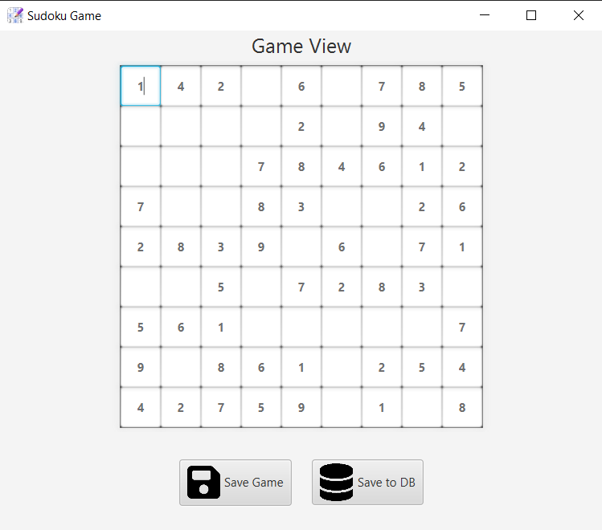

# Sudoku Java Desktop Application

## Table of Contents

- [Sudoku Java Desktop Application](#sudoku-java-desktop-application)
  - [Table of Contents](#table-of-contents)
  - [About the Project](#about-the-project)
  - [In-Game Screenshots](#in-game-screenshots)
    - [Main Menu](#main-menu)
    - [Gameplay](#gameplay)
    - [Save Game](#save-game)
  - [Dependencies](#dependencies)
  - [Installation](#installation)
  - [How to Play](#how-to-play)
  - [Features](#features)
  - [Internationalization](#internationalization)
  - [Database Schema](#database-schema)
  - [Testing](#testing)

## About the Project

Multi-Module Maven project (MVC) of Sudoku Game with JavaFX GUI. The app provides the ability to choose different levels of difficulty, change the language, save to file, save to DB, and load the data from the file or from the DB. The game can be saved whenever a user wants to do it and save current progress to a file or DB and again load data to continue the started game in next session.

## In-Game Screenshots

### Main Menu

<table>
  <tr>
    <td></td>
    <td></td>
  </tr>
  <tr>
    <td align="center">Main Menu ENG</td>
    <td align="center">Main Menu PL</td>
  </tr>
</table>

### Gameplay

<table>
  <tr>
    <td></td>
    <td></td>
  </tr>
  <tr>
    <td align="center">Gameplay ENG</td>
    <td align="center">Gameplay PL</td>
  </tr>
</table>

### Save Game

<table>
  <tr>
    <td></td>
    <td></td>
  </tr>
  <tr>
    <td align="center">Save Game DB</td>
    <td align="center">Save Game Filesystem</td>
  </tr>
</table>

## Dependencies

This project requires the following dependencies:

-   Java >21: Minimum version required for running the application.
-   JDK >21: Minimum version required for running the application.
-   JavaFX >22: for building the graphical user interface.
-   Maven >3.9: for project management and building.
-   JOOQ: for database interactions.
-   SQLite: as the database to store Sudoku boards.
-   SLF4J and Logback: for logging purposes.

## Installation

To set up and run this project locally, follow these steps:

1. **Clone the repository**:

    ```sh
    git clone https://github.com/Oskarowski/sudoku-desktop-game.git
    cd sudoku-desktop-game
    ```

2. **Build the project**:

    ```sh
    mvn install
    ```

3. **Run the application**:
    ```sh
    mvn javafx:run -pl View
    ```

## How to Play

1. **Start the Game**:

    - Launch the application, choose difficulty and click on "New Game". Or load previous game from DB or filesystem.

2. **Save Game**:

    - Click on the "Save Game" button to save your current Sudoku board to a file.
    - You can also save your game to a database by clicking the "Save to DB" button.

3. **Load Game**:

    - To load a game from a file, click on the "Load Game" button.
    - To load a game from the database, first select the desired saved game from the list and next click on the "Load from DB" button and .

4. **Solve Sudoku**:
    - Fill in the cells with numbers from 1 to 9. Each number can appear only once per row, column, and 3x3 grid.

## Features

-   **Save and Load Game**: Save your game progress to a file or database and load it anytime.
-   **Database Integration**: Store and retrieve Sudoku boards from DB (SQLite).
-   **System Filebase Integration**: Store and retrieve Sudoku boards using the system's filesystem (object serialization).
-   **Internationalization**: Supports multiple languages.
-   **User-friendly Interface**: Intuitive and easy-to-use GUI built with JavaFX.
-   **Difficulty Levels**: Choose from 3 different levels of difficulty.
-   **Logging**: Comprehensive logging for debugging.

## Internationalization

This application supports currently English and Polish languages. The localization is handled using `ResourceBundle` to load the appropriate language properties files based on the user's locale.

## Database Schema

The Sudoku game uses a **SQLite** database to store game boards and fields.

For an ER diagram illustrating the database schema, please refer to [ER Diagram](JdbcDao/src/main/java/sudoku/jdbcdao/database/database-schema.md).

## Testing

This project uses **JUnit Jupiter** for unit tests and **JaCoCo** for code coverage analysis.
<br>To execute the tests, run:

```sh
mvn test
```
